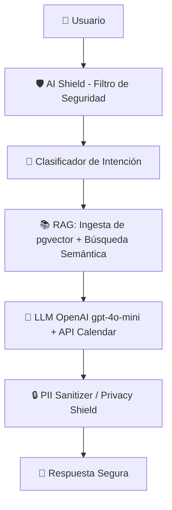

# 🏭 Sentinel Factory — Motor de Agentes Trabajadores Digitales

> **SaaS multi-tenant para agencias de marketing.** Permite crear, gestionar y revender agentes de IA personalizados a PYMEs sin tocar una sola línea de código.

---

## 🎬 Videos Demo

- **AI Agent en segundos:** https://youtu.be/UXzRDa_hzqo
- **Autopilot Engine:** https://youtu.be/M3Z6Qn_zHcs
- **AI Shield en acción:** https://youtu.be/01zuAVJCvEE

---

## 🤖 ¿Qué es Sentinel Factory?
Sentinel Factory es un motor donde la agencia ingresa la URL de un cliente y, **en solo 30 segundos**, genera un agente listo con los servicios, precios, horarios y personalidad de ese negocio específico.

*   👥 **Multi-tenant:** Administra docenas de agentes independientes desde un solo dashboard.
*   🎭 **White-label total:** El cliente final solo ve su marca, sus colores y su personalidad. Sentinel Factory es invisible.
*   🧠 **Agente, no chatbot:** No es un árbol de decisiones rígido. Es IA real que responde, agenda y captura leads.

---

## 📐 Arquitectura de Flujo de Datos
*Transparencia total: en la demo, cada mensaje permite ver la latencia en milisegundos de cada capa del motor.*



---

## 🛡️ AI Shield — Seguridad en Producción

- Detecta y bloquea **jailbreak, extracción de prompt, código malicioso y abuso** — antes de que el mensaje llegue al LLM.
- **Auto-bloqueo de IP tras 3 intentos** en una ventana de 10 minutos.
- **Alerta por email al dueño** en cada bloqueo.
- Ya bloqueó ataques reales contra el demo público en producción — verificado en logs, no simulado.

---

## 🚀 El "Autopilot Engine": Tu Motor de Ventas
La plataforma no solo crea bots, los vende por ti de forma automatizada:

1.  🔍 **Prospección On-Demand:** Escanea Google Maps por ciudad + categoría (cantidad de prospectos a elección del usuario).
2.  ⚙️ **Generación Automática:** Crea un bot de demo para cada prospecto usando su propia web.
3.  📸 **Prueba Social Instantánea:** Genera un screenshot (PNG 1200×630) mostrando el bot respondiendo preguntas reales del negocio.
4.  💬 **Outreach por WhatsApp:** Genera un link wa.me con mensaje pre-armado y el screenshot, listo para enviar al dueño del negocio.

---

## ✨ Características del Agente

*   🎯 **RAG Estricto:** Responde basándose en los documentos (PDFs, FAQs) del negocio. Si no sabe, no inventa.
*   📅 **Agendamiento:** Conectado a Google Calendar. Gestiona disponibilidad y confirma citas en la conversación.
*   📥 **Captura de Leads:** Extrae nombre, teléfono, email e interés; notifica al dueño por correo al instante.
*   📞 **Escala a Humano:** Si el cliente lo pide, despliega un botón directo al WhatsApp del negocio.
*   📈 **Auto-aprendizaje:** Registra las preguntas donde el bot falló. La agencia enseña la respuesta correcta y el bot la guarda para siempre.

---

## 🧪 Calidad Técnica y Stack Engine

*   🐍 **Backend:** Python 3.13 + FastAPI (async).
*   🗄️ **Base de Datos:** PostgreSQL con `pgvector` para búsqueda semántica.
*   🧠 **IA:** OpenAI `gpt-4o-mini` (chat) + `text-embedding-3-small` (RAG).
*   📲 **Mensajería:** Twilio (WhatsApp), credenciales por tenant, con validación de firma.
*   🤖 **Automatización:** Playwright (scraping), Resend (correos transaccionales), Stripe (pagos).
*   🐋 **Deploy:** Docker-Compose probado en Railway.
*   ✅ **Tests:** 250 tests automatizados, suite offline en verde.

---

## 💰 Modelo de Negocio para la Agencia

**Planes de la plataforma:**

| Plan | Precio | Agentes | Destacado |
| :--- | :--- | :--- | :--- |
| Starter | **$39/mes** | 3 | Widget web + WhatsApp (BYOK Twilio) |
| Professional | **$149/mes** | 10 | Autopilot Engine + métricas + ROI |
| Enterprise | **$899/mes** | Hasta 100 | Soporte prioritario + credenciales Twilio propias |

**Rentabilidad de ejemplo (plan Professional):**

| Concepto | Detalle |
| :--- | :--- |
| **Costo Plataforma** | Plan Professional (10 agentes) = **$149/mes** |
| **Venta Sugerida** | $150 – $300 USD/mes por cliente |
| **Rentabilidad** | Con 10 clientes a ~$200/mes c/u, la agencia genera **$2,000 USD** de ingresos con un margen neto de **≈$1,851 USD** *(ejemplo ilustrativo, no un resultado real)*. |

---

## 💻 Instalación Rápida

```bash
# Clonar el repositorio
git clone https://github.com/dannisk9/sentinel
cd sentinel

# Configurar variables de entorno
cp .env.example .env
# Nota: Edita el archivo .env con tus respectivas API keys

# Levantar servicios
docker-compose up --build
```

---

## 📋 Qué No Está Incluido

*   **Pre-revenue:** no hay clientes pagando activos todavía. Se vende como activo de código + infraestructura, no como negocio con ingresos.
*   **Las API keys NO se transfieren:** el comprador debe usar sus propias credenciales para Stripe, OpenAI, Apify, Twilio (BYOK por tenant, por diseño), Google Cloud y Resend.
*   **Stripe no está activado en producción:** el código de checkout + webhooks está completo, solo falta configurar las keys del comprador y las variables de entorno en Railway.

---

## 💳 Licencia y Compra

Producto propietario, pago único: **$5,900 USD — o mejor oferta**.

**¿Qué incluye?**
*   📦 Código fuente completo.
*   🛠️ 30 días de soporte garantizado.
*   📞 Llamada de onboarding + Documentación técnica.

*¿Necesitas integraciones a medida (WhatsApp API, voz con ElevenLabs, apps móviles)? Consulta por nuestras tarifas de desarrollo post-venta.*

**→ Disponible en marketplaces de venta de SaaS pre-revenue — pregunta por el link de listing vigente.**

